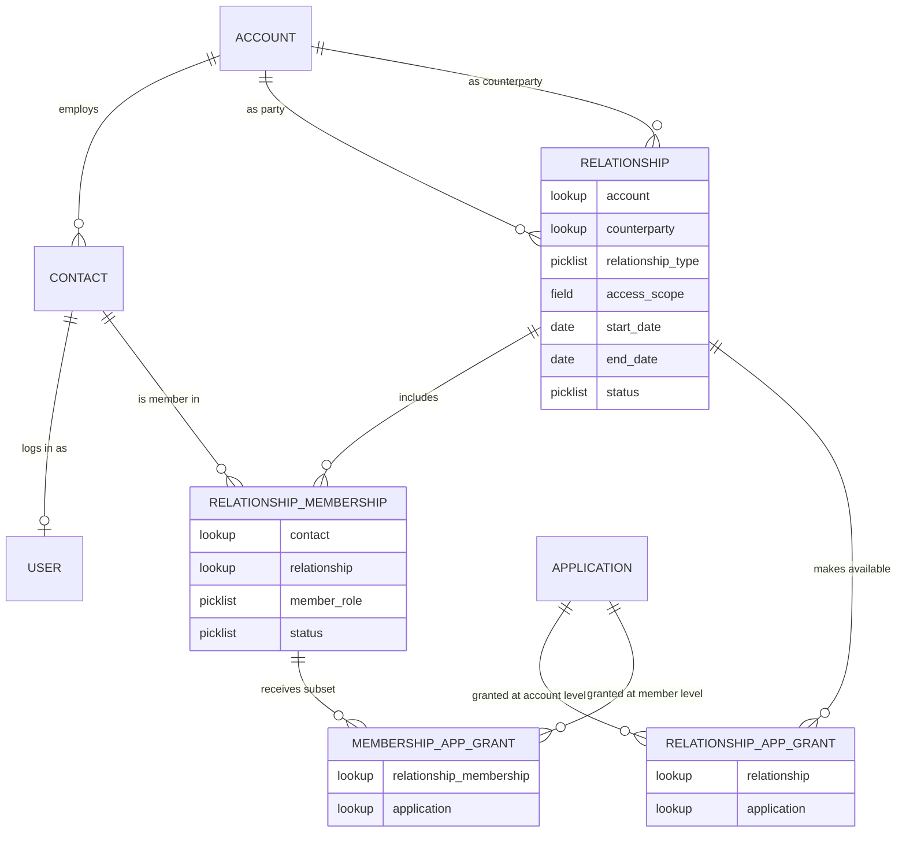

# Salesforce Data Model

*The object model behind [Relationship-Derived Access](../README.md). This is the logical model the patterns assume. It is not deployable metadata: object and field names are illustrative, and you will map them to your own domain.*

**Read [Pattern 1](../patterns/01-relationship-record.md) first.** This document shows how the pieces fit together once you have decided to build it. For the sharing engine and the licence decision, see [implementation-notes.md](implementation-notes.md).

The model works at two levels, and both matter. The **account relationship** records that a business participates in a scoped, time-bound relationship. The **membership** records that a *person* participates in that relationship, and it is what lets one person act across several accounts with a different subset of access in each. A model that stops at the account level cannot express "the same user works for two dealers," which is the whole point of [Pattern 3](../patterns/03-relationship-context.md). So the person layer is not optional.

---

## The shape in one picture

Read it top to bottom. A business (Account) has people (Contacts), each with a login (User). The business participates in one or more Relationships. A person joins a Relationship through a Membership, so one person can hold several. Applications are granted to the Relationship at the account level, and then a subset is granted to each Membership at the person level.

---

## Objects

### Standard objects

| Object | Role here |
|---|---|
| **Account** | The business. |
| **Contact** | A person at a business. One person, one Contact, even if they act across several relationships. |
| **User** | The portal login, one to one with a Contact. |

### Relationship

The account's scoped participation in one relationship. One business can hold many, which is what removes the duplicate-account workaround. This is [Pattern 1](../patterns/01-relationship-record.md).

| Field | Type | Notes |
|---|---|---|
| Account | Lookup(Account) | The business whose participation this record represents. |
| Counterparty | Lookup(Account) | The party on the other side, for example the distributor. Two relationships with two distributors are two records, which is how competitive isolation stays clean. |
| Relationship Type | Picklist | Distributor, Dealer, Service Provider, Parent Branch. |
| Access Scope | Field or child | Brand, territory, product family. See [Relationship Scope](#relationship-scope-optional). |
| Start Date / End Date | Date | The contractual window. End Date drives the scheduled sweep. |
| Status | Picklist | Active, Suspended, Ended. Separate from the dates. |

One Account, many Relationships. This is the "one dealer, many relationships" of Pattern 1.

**Relationship is a junction object between two Accounts.** Both `Account` and `Counterparty` are lookups to Account, so a single Relationship row bridges two businesses. Because both sides are Accounts, relationships chain: Manufacturer to Distributor, Distributor to Dealer, Dealer to Contractor. That chain is a multi-tier hierarchy the native single-parent Account hierarchy cannot express, which is the point of modelling the relationship as its own record rather than a parent field.

### Relationship Membership

**This is the person layer, and the object my earlier draft was missing.** It records that a Contact participates in a specific Relationship. A Contact can have many Memberships, one per relationship they act in, which is exactly how a single person works across two dealers.

| Field | Type | Notes |
|---|---|---|
| Contact | Lookup(Contact) | The person. |
| Relationship | Lookup(Relationship) | The specific account relationship they participate in. |
| Member Role | Picklist | Admin, Buyer, Service, Read-only. The person's role *within this relationship*, which can differ from their role in another. |
| Status | Picklist | Active, Suspended, Ended, independent of the person and of the relationship. |

One Contact, many Memberships. One Relationship, many Memberships. The Membership is the join, and it is where "who is this person, in this relationship" lives.

### Application, and the two grant tiers

Application access is assigned twice, and the second tier is always a subset of the first.

| Object | Field | Type | Notes |
|---|---|---|---|
| **Application** | Name | Text | The target application. |
| | Access Method | Picklist | SSO (SAML or OIDC), Canvas, OAuth API, Public link. |
| **Relationship Application Grant** | Relationship | Lookup(Relationship) | Which applications the account relationship makes available. The full set for that relationship. |
| | Application | Lookup(Application) | |
| **Membership Application Grant** | Relationship Membership | Lookup(Relationship Membership) | Which of the relationship's applications this specific person gets. |
| | Application | Lookup(Application) | Must be one already granted to the parent Relationship. |

**The subset invariant.** A person can only be granted an application the relationship already has. The account-level grant defines the universe; the member-level grant narrows it. Enforce it: a Membership Application Grant whose Application is not in the parent Relationship's grants is invalid, and that check belongs in Apex or Flow, because the platform will not enforce it for you.

### Relationship Scope (optional)

A child of Relationship for when scope spans several dimensions. Same as before: Dimension (Brand, Territory, Region, Product Family) and Value. One or two stable dimensions are just fields on Relationship.

### Derived and engine objects (unchanged)

The `[Object]__Share` rows the engine writes, tagged with an Apex sharing reason on custom objects, and the small **Engine Share Ownership** object used to track engine-created shares on standard objects. These are outputs and bookkeeping, not part of the relationship model. See [implementation-notes.md](implementation-notes.md).

---

## One person, many accounts

This is the case a simpler model cannot express, and the reason the Membership object exists.

Jane is one Contact with one User login. She participates in two relationships: Summit Denver's relationship with Distributor North, and Summit Boulder's relationship with Distributor West. That is two Membership records against two different Relationships, both pointing at the same Contact.

- When Jane acts as Summit Denver, her visible records come from that Relationship (Pattern 2), and her available applications come from *that* Membership's grants.
- When she switches to Summit Boulder, the active Membership changes, and both the records and the applications change with it.
- She never has a second login, and neither dealer's data bleeds into the other, because the boundary is the Membership and its Relationship, not the person.

The "dealer picker" in [Pattern 3](../patterns/03-relationship-context.md) is, in data terms, **the selection of the active Membership.** Everything downstream, visibility and application access, resolves from that selection, re-validated server-side.

---

## Two tiers of application assignment

Worth stating on its own, because it is where portals get access wrong.

1. **Account tier.** The relationship makes a set of applications available. Summit Denver's relationship grants the ordering system, the warranty system, and the catalog.
2. **Person tier.** Each member gets a subset. Jane, as a buyer, gets ordering and the catalog. A service contact in the same relationship gets warranty and the catalog. Neither can be granted anything the relationship itself does not have.

Modelling this as one tier, applications straight on the person, loses the account boundary and lets a person be granted something their account relationship was never entitled to. Modelling it only at the account tier gives every person in a dealer the same access, which is wrong the first time a dealer has both a buyer and a read-only viewer.

---

## Cardinalities that matter

| From | To | |
|---|---|---|
| Account | Contact | one to many |
| Contact | User | one to one |
| Account | Relationship | one to many |
| Relationship | Relationship Membership | one to many |
| **Contact** | **Relationship Membership** | **one to many** (the multi-account person) |
| Relationship | Relationship Application Grant | one to many |
| Relationship Membership | Membership Application Grant | one to many |
| Membership Application Grant | Application | must be within the parent Relationship's grants |

---

## Hierarchy versus relationship: what reads from where

| Question | Read from |
|---|---|
| Who owns whom, legally? Roll-up reporting? | Account hierarchy |
| Who does this business work with, for what, where, for how long? | Relationship |
| Is this person part of this relationship, and in what role? | Relationship Membership |
| What can this user see? | Shares derived from the active Relationship |
| What applications is this user offered? | Membership Application Grants for the active Membership |
| Who is this user acting for right now? | The active Membership, held server-side, not on a record |

---

## The context layer is not an object

The active membership, the answer to "who are you acting for right now," is **not** a field on User or Contact. It is held in trusted server-side state and re-validated on every entry point against the person's actual Memberships. Putting it on a record, or trusting it from the client, is the failure mode [Pattern 3](../patterns/03-relationship-context.md) is written to prevent.

---

## A note on names

The objects and fields above are a logical model, not a deployable package, and the names are illustrative. Real implementations use different names. Dealer and distributor language is used only to keep the model concrete. The shape holds wherever a person participates in more than one scoped, time-bound relationship and receives a subset of what that relationship grants.
